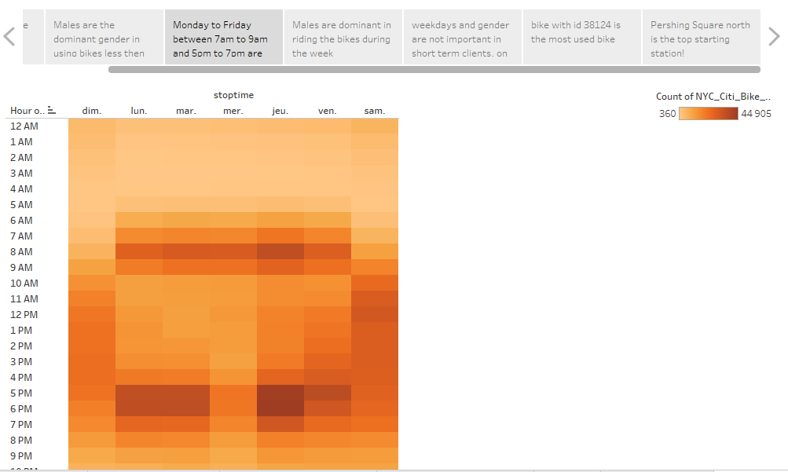
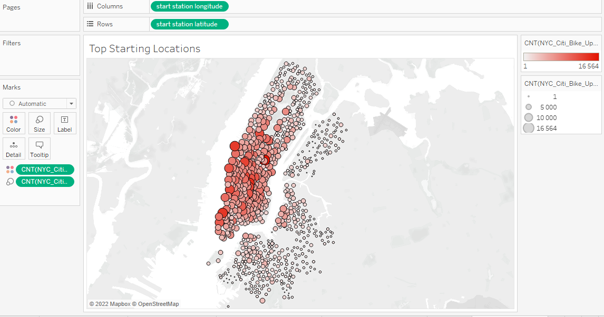
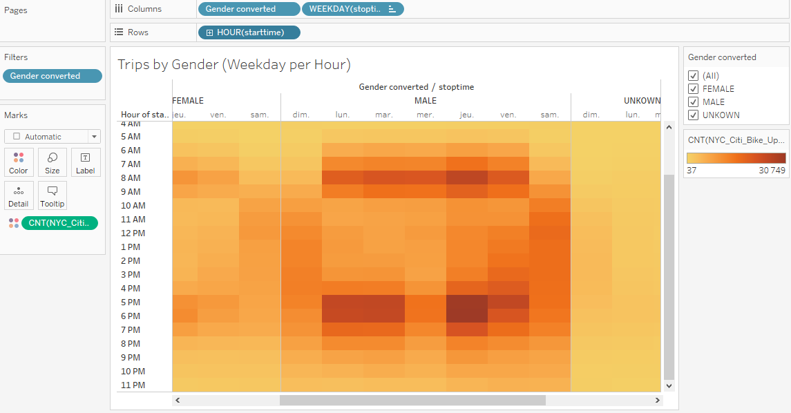
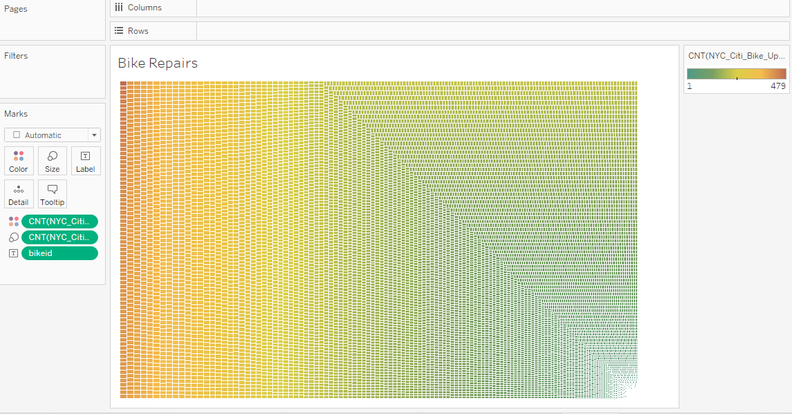
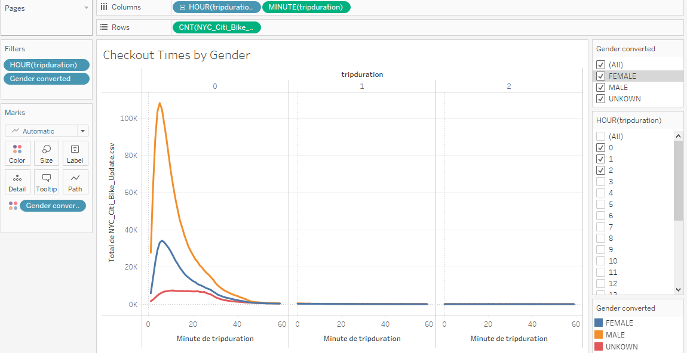
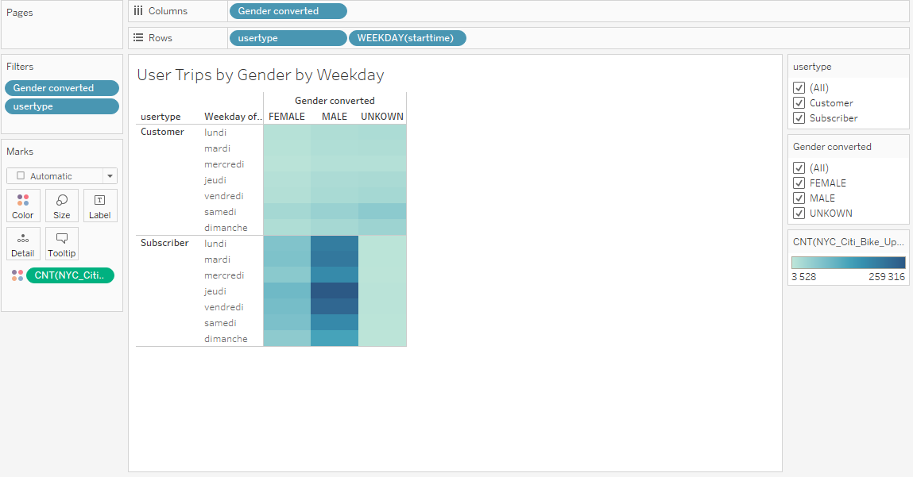

# bikesharing
An analysis of NYC CitiBike bikesharing data from August, 2019, with Tableau

## Overview
Here our story begins:

Before getting into the details of the above mentioned story, The framework for this project was to analyze bikeshare data from CitiBike in New York City for presentation to investors looking to begin a bikeshare program in Des Moines, Iowa. Even though, the two locations are quite different, analyzing the data over NYC, will help give insights and answer key questions!
- What gender uses the bikes most?
- What weekdays are the busiest?
- What bikes are to be repaired and what's the best time to repair them?

## Results

The dominant gender using the bikes are males followed by females and than others, although this isn't enough classification as the gender alone is not a key factor, as being a subscriber shows a regular usage of bikes against being a short term client.
Now before getting more in depth about this affects the income of the project, let's view the top starting stations with the station Pershing Square North being the first.

The above map displays the bike stations from which recorded bike trips started. The size of the circles and darkness of the red indicate the relative number of trips started at those locations. It is apparent that the bulk of the bike trips are originating in the bustling commercial heart of Lower Manhattan, as it is the busiest area and the most entrainement offering. Bike usage is lower in the less densely packed surrounding neighborhoods.

The above image shows that the busiest hours are from 6am to 9am and from 5pm to 7pm from Monday to Friday, but we also notice that during Saturday and Sunday when people are off work they enjoy riding bikes throughout the day as these weekend days seems to be busy more than other days during 10am to 5pm. We also notice that from 2am to 5am there is practically a very low usage, so this could be the perfect time to repaire bikes, hence the following image:

This visualization is a stepped-level heatmap and it shows the bikes that are most used, red means used the most and blue means used the least, this will help determine the bikes to be repaired as we already figured out the time to repair them without affecting the flow of business.

This graphs shows that the majority of the rides are less than 60 minutes, more precisely most of the rides are around 15 minutes, the graph also shows the already mentioned point of males being the most dominant gender followed by females and than others (this might be for the lack of precise data about gender)

This heatmap shows again that the most profitable client is a male subscriber, it also reinforces the point that the busiest days are Thursday and Friday, an additional study must be conducted to further investigate why?

## Summary
In conclusion, bikeshare services are remarkably popular in busy metropolitan areas, where occupied real estate is densely packed and parking spaces may be scarce. The user base is made up mostly of male subscribers, providing regular income to the program. More outreach should be done to attract female riders, but male users seem a reliable market. And main usage seems focused around morning and evening commute times.

